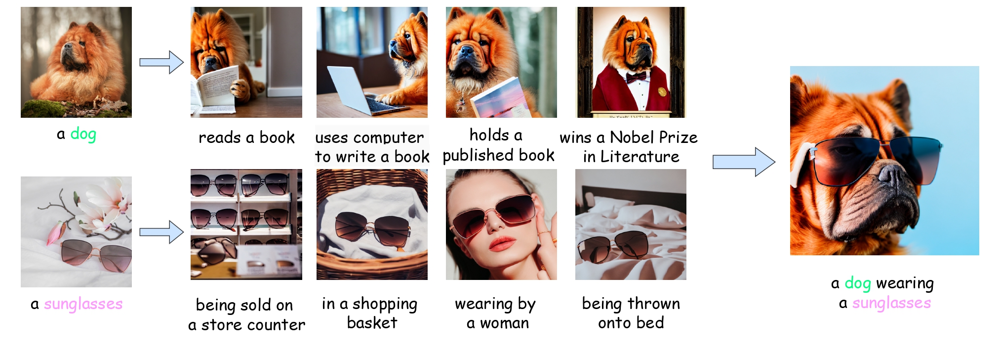
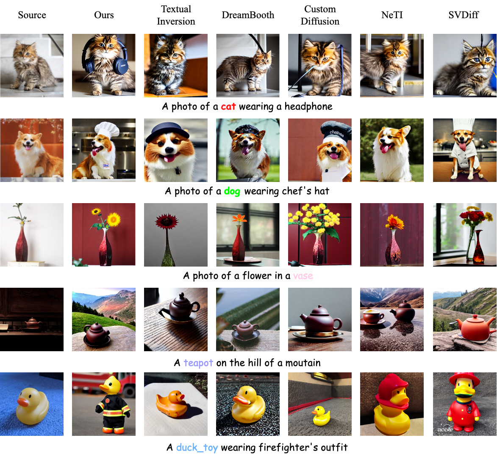
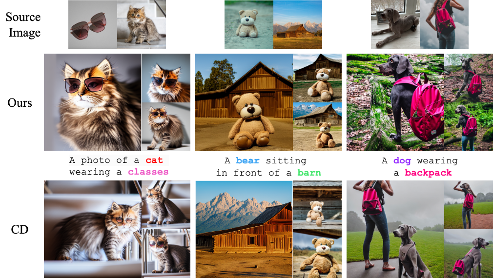
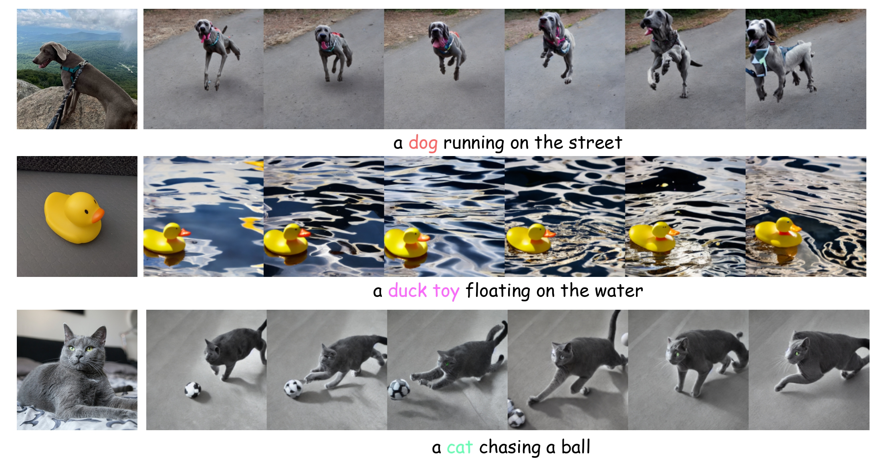

# ClassDiffusion: More Aligned Personalization Tuning with Explicit Class Guidance

Official imple. of ClassDiffusion: More Aligned Personalization Tuning with Explicit Class Guidance

> Recent text-to-image customization works have been proven successful in generating images of given concepts by fine-tuning the diffusion models on a few examples. However, these methods tend to overfit the concepts, resulting in failure to create the concept under multiple conditions (_e.g._, headphone is missing when generating &ldquo;a &lt;sks&gt; dog wearing a headphone&rdquo;). Interestingly, we notice that the base model before fine-tuning exhibits the capability to compose the base concept with other elements (_e.g._, &ldquo;a dog wearing a headphone&rdquo;), implying that the compositional ability only disappears after personalization tuning. Inspired by this observation, we present ClassDiffusion, a simple technique that leverages a semantic preservation loss to explicitly regulate the concept space when learning the new concept. Despite its simplicity, this helps avoid semantic drift when fine-tuning on the target concepts. Extensive qualitative and quantitative experiments demonstrate that the use of semantic preservation loss effectively improves the compositional abilities of the fine-tune models. In response to the ineffective evaluation of CLIP-T metrics, we introduce BLIP2-T metric, a more equitable and effective evaluation metric for this particular domain. We also provide in-depth empirical study and theoretical analysis to better understand the role of the proposed loss. Lastly, we also extend our ClassDiffusion to personalized video generation, demonstrating its flexibility.

---

**[ClassDiffusion: More Aligned Personalization Tuning with Explicit Class Guidance](https://arxiv.org/pdf/2405.17532)**

[Jiannan Huang](https://rbrq03.github.io/), [Jun Hao Liew](https://scholar.google.com.sg/citations?user=8gm-CYYAAAAJ), [Hanshu Yan](https://hanshuyan.github.io), [Yuyang Yin](https://yuyangyin.github.io), [Humphrey Shi](https://www.humphreyshi.com/), [Yao Zhao](http://mepro.bjtu.edu.cn/zhaoyao/index.htm), [Yunchao Wei](https://weiyc.github.io/index.html)

[](https://classdiffusion.github.io/)
[](https://arxiv.org/pdf/2405.17532)

<p align="center">
  
<br>
<em>Our method can generate more aligned personalized images with explicit class guidance</em>
</p>

## News

- [23 Jan, 2025] 🎉 Our paper is accepted to ICLR2025!
- [8 Jun. 2024] Code for BLIP2-T and Video Generation Realeased!
- [3 Jun. 2024] Code Released!
- [29 May. 2024] Paper Released!

## Code Usage

**Set Up**

```
git clone https://github.com/Rbrq03/ClassDiffusion.git
cd ClassDiffusion
pip install -r requirements.txt
```

_Warning: Currently, ClassDiffusion don't support PEFT, please ensure PEFT is uninstalled in your environment, or check [PR](https://github.com/huggingface/diffusers/pull/7272). We will move forward with this PR merge soon._

### Training

**Single Concept**

```
bash scripts/train_single.sh
```

**Multiple Concepts**

```
bash scripts/train_multi.sh
```

### Inference

**single concept**

```
import torch
from diffusers import DiffusionPipeline

pipeline = DiffusionPipeline.from_pretrained(
    "runwayml/stable-diffusion-v1-5", torch_dtype=torch.float16,
).to("cuda")
pipeline.unet.load_attn_procs("path-to-save-model", weight_name="pytorch_custom_diffusion_weights.bin")
pipeline.load_textual_inversion("path-to-save-model", weight_name="<new1>.bin")

image = pipeline(
    "<new1> dog swimming in the pool",
    num_inference_steps=100,
    guidance_scale=6.0,
    eta=1.0,
).images[0]
image.save("dog.png")
```

**Multiple Concepts**

```
import torch
from diffusers import DiffusionPipeline

pipeline = DiffusionPipeline.from_pretrained("runwayml/stable-diffusion-v1-5", torch_dtype=torch.float16).to("cuda")
pipeline.unet.load_attn_procs("path-to-save-model", weight_name="pytorch_custom_diffusion_weights.bin")
pipeline.load_textual_inversion("path-to-save-model", weight_name="<new1>.bin")
pipeline.load_textual_inversion("path-to-save-model", weight_name="<new2>.bin")

image = pipeline(
    "a <new1> teddy bear sitting in front of a <new2> barn",
    num_inference_steps=100,
    guidance_scale=6.0,
    eta=1.0,
).images[0]
image.save("multi-subject.png")
```

**BLIP2-T**

You can use following code:

```
from PIL import Image
from utils.blip2t import BLIP2T

blip2t = BLIP2T("Salesforce/blip-itm-large-coco", "cuda")

prompt = "photo of a dog"
image = Image.open("data/dog/00.jpg")

score = blip2t.text_similarity(prompt, image)[0]
score
```

or

```
python blip2t.py
```

**Video Generation**

```
python videogen.py
```

**Ckpt for quick test**

|Concept(s)|Weight|
|--|--|
|dog|[weight](https://drive.google.com/drive/folders/12KhBmFCUb2opotOQeAH0-dvW9XArwukt?usp=drive_link)|
|bear+barn|[weight](https://drive.google.com/drive/folders/1VQTvszl2FqKhc-9YaKsRTRV3qlhmOqK4?usp=drive_link)|

## Results

**Single Concept Results**

<p align="center">
  
<br>
</p>

**Multiple Concepts Results**

<p align="center">
  
<br>
<em></em>
</p>

**Video Generation Results**

<p align="center">
  
<br>
<em></em>
</p>

## TODO

- [x] Training Code for ClassDiffusion
- [x] Inference Code for ClassDiffusion
- [x] Pipeline for BLIP2-T Score
- [x] Inference Code for Video Generation with ClassDiffusion

## Citation

If you make use of our work, please cite our paper.

```bibtex
@article{huang2024classdiffusion,
  title={ClassDiffusion: More Aligned Personalization Tuning with Explicit Class Guidance},
  author={Huang, Jiannan and Liew, Jun Hao and Yan, Hanshu and Yin, Yuyang and Zhao, Yao and Wei, Yunchao},
  journal={arXiv preprint arXiv:2405.17532},
  year={2024}
}
```

## Acknowledgement

We thanks to the following repo for their excellent and well-documented code based:

- Diffusers: [https://github.com/huggingface/diffusers](https://github.com/huggingface/diffusers)
- Custom Diffusion: [https://github.com/adobe-research/custom-diffusion](https://github.com/adobe-research/custom-diffusion)
- Transformers: [https://github.com/huggingface/transformers](https://github.com/huggingface/transformers)
- DreamBooth: [https://github.com/google/dreambooth](https://github.com/google/dreambooth)
- AnimateDiff: [https://github.com/guoyww/AnimateDiff](https://github.com/guoyww/AnimateDiff)
